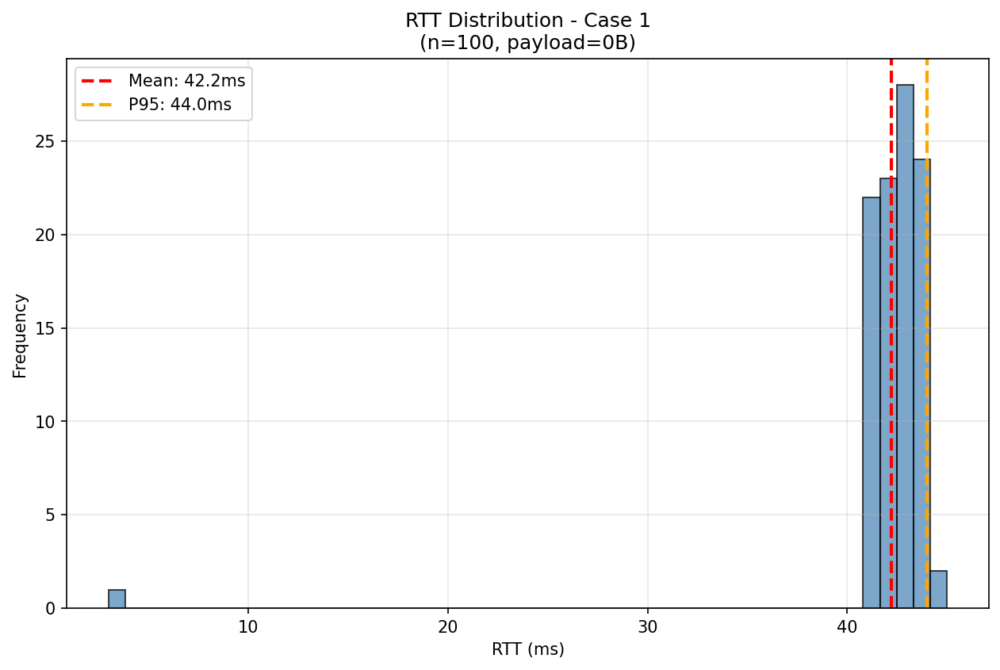
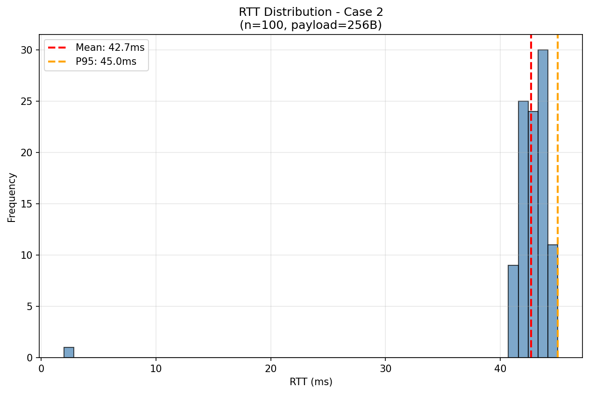
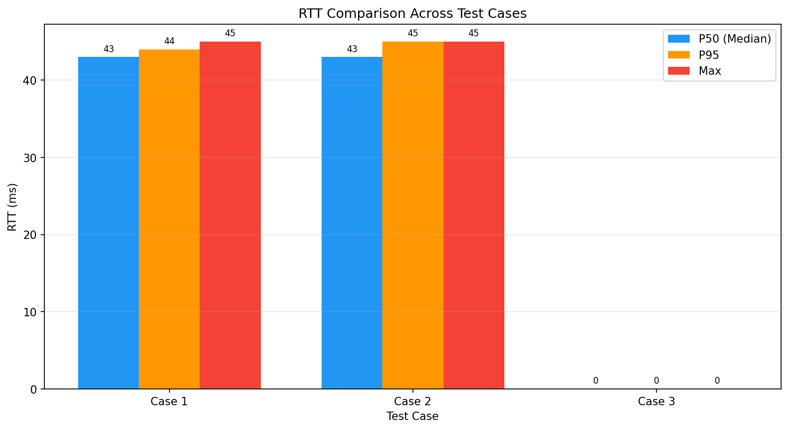
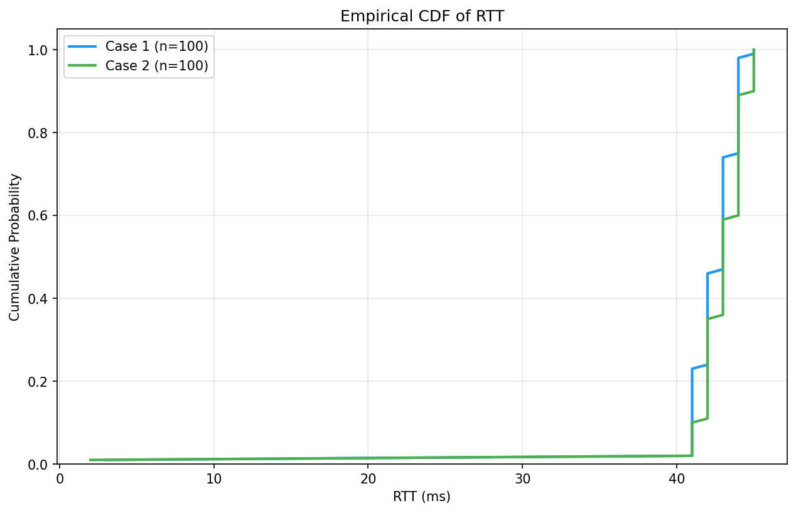

# 📊 Báo Cáo Đo Độ Trễ RTT — MQTT Traffic Light Demo

> **Ngày tạo:** 2026-02-08 17:19:38
> **Đề tài NCKH:** Giám sát và điều khiển đèn giao thông qua IoT–MQTT

---

## 1. Mục Tiêu

Đánh giá hiệu suất truyền thông MQTT giữa Dashboard (Node-RED) và Edge Device (ESP32/Mock) thông qua phép đo **Round-Trip Time (RTT)** từ lúc gửi command đến khi nhận acknowledgment.

## 2. Setup Thí Nghiệm

| Thành phần | Cấu hình |
|------------|----------|
| Broker | Mosquitto 2.x (Docker, localhost:1883) |
| Edge Device | mock_esp32.py (Python simulator) |
| QoS cmd/ack | QoS 1 (at-least-once) |
| Topic cmd | `city/demo/intersection/001/cmd` |
| Topic ack | `city/demo/intersection/001/ack` |

### Định nghĩa RTT

```
RTT = t_ack_recv - t_cmd_send (milliseconds)
```

- `t_cmd_send`: Thời điểm Dashboard publish command
- `t_ack_recv`: Thời điểm Dashboard nhận được ack từ Edge

## 3. Các Case Thí Nghiệm

| Case | Payload (bytes) | Count | Interval (ms) | Mô tả |
|------|-----------------|-------|---------------|-------|
| Case 1 | 0 | 100 | 100 | Baseline |
| Case 2 | 256 | 100 | 100 | Payload +256B |
| Case 3 | 1024 | 100 | 100 | Payload +1024B |

## 4. Kết Quả Tổng Hợp

| Case | Sent | Recv | Loss% | Mean (ms) | Median | P95 | P99 | Max |
|------|------|------|-------|-----------|--------|-----|-----|-----|
| Case 1 | 100 | 100 | 0.0% | 42.2 | 43.0 | 44.0 | 45.0 | 45.0 |
| Case 2 | 100 | 100 | 0.0% | 42.7 | 43.0 | 45.0 | 45.0 | 45.0 |
| Case 3 | 100 | 0 | 100.0% | 0.0 | 0.0 | 0.0 | 0.0 | 0.0 |

### Quy tắc phát hiện Outlier

```
outlier_threshold = min(P95 × 2, Median + 3×Std)
```

## 5. Biểu Đồ

### Case 1



### Case 2



### Case 3


### So sánh giữa các Case



### ECDF



## 6. Nhận Xét

### Xu hướng theo Payload Size

- Payload tăng từ 0B → 1024B
- RTT mean: 42.2ms → 0.0ms (không đổi hoặc giảm)
- Có packet loss: Case 3=100.0%

### Hạn chế khi dùng Mock ESP32

> ⚠️ **Lưu ý quan trọng**

- Mock chạy trên cùng máy với Broker → RTT không phản ánh độ trễ mạng thực
- Không có độ trễ WiFi, xử lý phần cứng, interrupt...
- Kết quả chỉ đo overhead của MQTT protocol + JSON parse

**Kế hoạch:** Lặp lại thí nghiệm với ESP32 thật qua WiFi để có số liệu thực tế.

## 7. Gợi Ý Mở Rộng Đô Thị

| Giải pháp | Mô tả | Trade-off |
|-----------|-------|-----------|
| **Broker Bridge** | Mosquitto bridge giữa các khu vực | Tăng độ trễ inter-region, giảm tải broker trung tâm |
| **Broker Cluster** | Multiple broker với load balancing | Phức tạp hóa infrastructure, cần sticky sessions |
| **QoS Trade-off** | QoS 0 cho state (high-freq), QoS 1 cho cmd/ack | Mất state acceptable, mất cmd không acceptable |
| **TLS/mTLS** | Encryption + mutual authentication | Thêm ~5-20ms handshake, tăng CPU |

## 8. Raw Data

- [Case 1](raw/case_0b.csv)
- [Case 2](raw/case_256b.csv)
- [Case 3](raw/case_1024b.csv)

---

> 📝 Báo cáo được tạo tự động bởi `run_benchmark_report.py`
