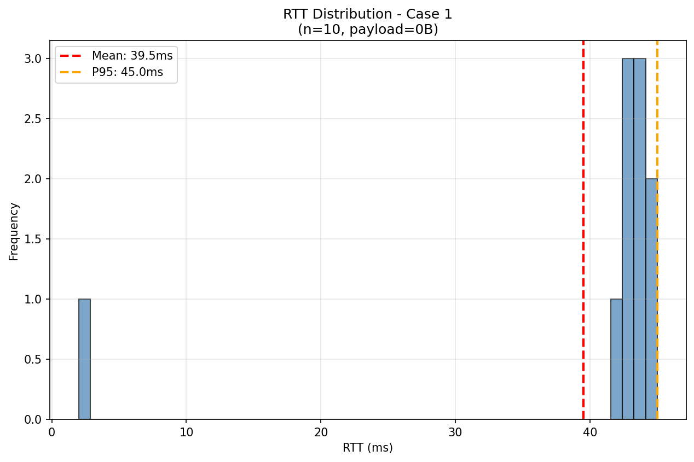
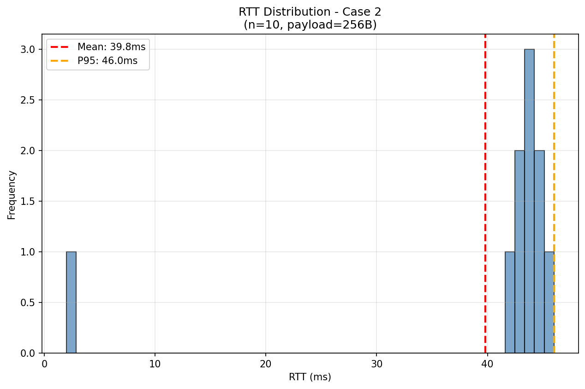
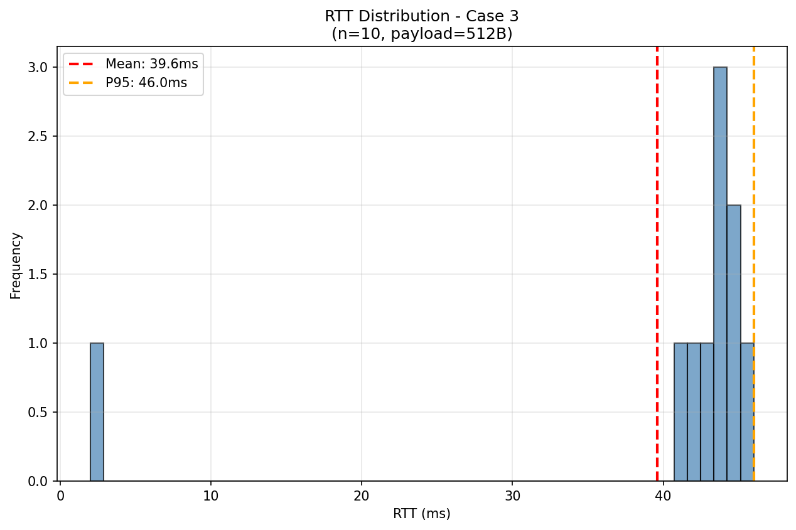
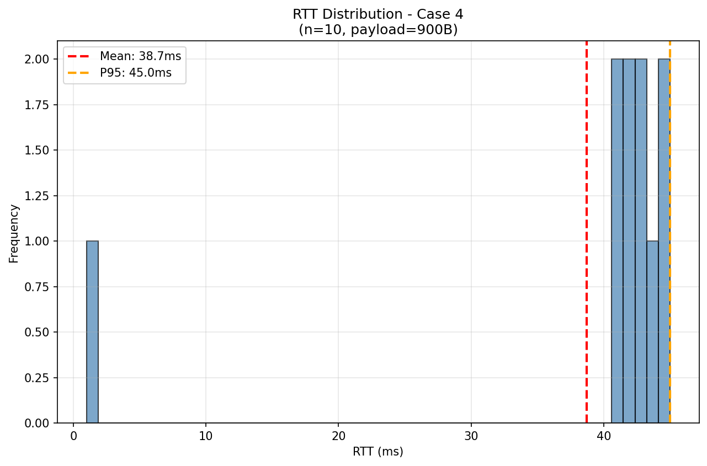
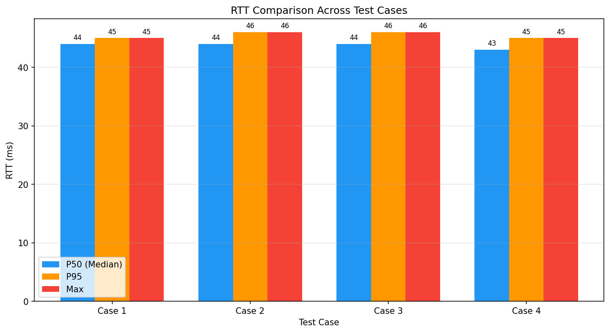
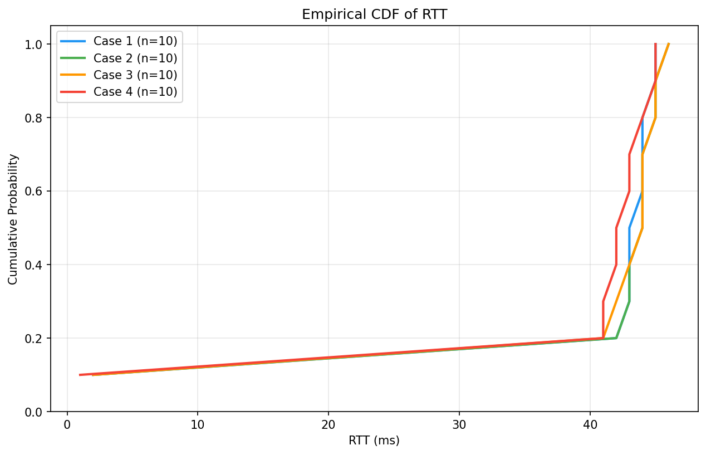

# 📊 Báo Cáo Đo Độ Trễ RTT — MQTT Traffic Light Demo

> **Ngày tạo:** 2026-02-16 14:58:35
> **Đề tài NCKH:** Giám sát và điều khiển đèn giao thông qua IoT–MQTT

---

## 1. Mục Tiêu

Đánh giá hiệu suất truyền thông MQTT giữa Dashboard (Node-RED) và Edge Device (ESP32/Mock) thông qua phép đo **Round-Trip Time (RTT)** từ lúc gửi command đến khi nhận acknowledgment.

## 2. Setup Thí Nghiệm

| Thành phần | Cấu hình |
|------------|----------|
| Broker | Mosquitto 2.x (Docker, localhost:1883) |
| Edge Device | mock_esp32.py (Python simulator) |
| QoS cmd/ack | QoS 1 (at-least-once) |
| Topic cmd | `city/demo/intersection/001/cmd` |
| Topic ack | `city/demo/intersection/001/ack` |

### Định nghĩa RTT

```
RTT = t_ack_recv - t_cmd_send (milliseconds)
```

- `t_cmd_send`: Thời điểm Dashboard publish command
- `t_ack_recv`: Thời điểm Dashboard nhận được ack từ Edge

## 3. Các Case Thí Nghiệm

| Case | Payload pad (bytes) | Actual payload bytes (avg) | Count | Interval (ms) | Mô tả |
|------|----------------------|----------------------------|-------|---------------|-------|
| Case 1 | 0 | 110.0 | 10 | 200 | Baseline |
| Case 2 | 256 | 377.0 | 10 | 200 | Payload +256B (<=1KB expected) |
| Case 3 | 512 | 633.0 | 10 | 200 | Payload +512B (<=1KB expected) |
| Case 4 | 900 | 1021.0 | 10 | 200 | Payload +900B (<=1KB expected) |
| Case 5 | 1200 | 1321.0 | 10 | 200 | Oversize payload +1200B (expected reject/no-ack) |

## 4. Kết Quả Tổng Hợp

| Case | Sent | Recv | Loss% | Mean (ms) | Median | P95 | P99 | Max | Status | Lý do |
|------|------|------|-------|-----------|--------|-----|-----|-----|--------|------|
| Case 1 | 10 | 10 | 0.0% | 39.5 | 43.5 | 45.0 | 45.0 | 45.0 | PASS | - |
| Case 2 | 10 | 10 | 0.0% | 39.8 | 44.0 | 46.0 | 46.0 | 46.0 | PASS | - |
| Case 3 | 10 | 10 | 0.0% | 39.6 | 44.0 | 46.0 | 46.0 | 46.0 | PASS | - |
| Case 4 | 10 | 10 | 0.0% | 38.7 | 42.5 | 45.0 | 45.0 | 45.0 | PASS | - |
| Case 5 | 10 | 0 | 100.0% | N/A | N/A | N/A | N/A | N/A | PASS | Expected reject/no-ack (oversize) |

### Quy tắc phát hiện Outlier

```
outlier_threshold = min(P95 × 2, Median + 3×Std)
```

## 5. Biểu Đồ

### Case 1



### Case 2



### Case 3



### Case 4



### Case 5


### So sánh giữa các Case



### ECDF



## 6. Nhận Xét

### Xu hướng theo Payload Size

- Payload tăng từ 0B → 900B
- RTT mean: 39.5ms → 38.7ms (không đổi hoặc giảm)
- Có packet loss: Case 5=100.0%
- Case 5: payload oversize → không đo RTT vì không có ack (expected)

### Hạn chế khi dùng Mock ESP32

> ⚠️ **Lưu ý quan trọng**

- Mock chạy trên cùng máy với Broker → RTT không phản ánh độ trễ mạng thực
- Không có độ trễ WiFi, xử lý phần cứng, interrupt...
- Kết quả chỉ đo overhead của MQTT protocol + JSON parse

**Kế hoạch:** Lặp lại thí nghiệm với ESP32 thật qua WiFi để có số liệu thực tế.

## 7. Gợi Ý Mở Rộng Đô Thị

| Giải pháp | Mô tả | Trade-off |
|-----------|-------|-----------|
| **Broker Bridge** | Mosquitto bridge giữa các khu vực | Tăng độ trễ inter-region, giảm tải broker trung tâm |
| **Broker Cluster** | Multiple broker với load balancing | Phức tạp hóa infrastructure, cần sticky sessions |
| **QoS Trade-off** | QoS 0 cho state (high-freq), QoS 1 cho cmd/ack | Mất state acceptable, mất cmd không acceptable |
| **TLS/mTLS** | Encryption + mutual authentication | Thêm ~5-20ms handshake, tăng CPU |

## 8. Raw Data

- [Case 1](raw/case_0b.csv)
- [Case 2](raw/case_256b.csv)
- [Case 3](raw/case_512b.csv)
- [Case 4](raw/case_900b.csv)
- [Case 5](raw/case_1200b.csv)

---

> 📝 Báo cáo được tạo tự động bởi `run_benchmark_report.py`
